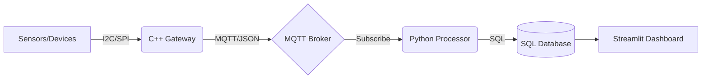

# SmartTool-Link: Industrial IoT Monitoring System
# SmartTool-Link: 工业级物联网监控系统

---

## 1. Project Overview | 项目概述
**SmartTool-Link** is a lightweight, high-performance IoT gateway and monitoring system designed for industrial power tools. It demonstrates a complete data pipeline from edge sensors to cloud-based visualization.

**SmartTool-Link** 是一个为工业电动工具设计的轻量化、高性能物联网网关与监控系统。该项目展示了从边缘传感器到云端可视化的完整数据链路。

---

## 2. Key Features | 核心功能
* **Edge Data Acquisition (C++):** High-frequency sensor data simulation (Vibration, Temperature, Current) using Object-Oriented Design.
    * **边缘数据采集 (C++):** 使用面向对象设计，实现传感器数据（振动、温度、电流）的高频模拟采集。
* **Resilient Communication:** Asynchronous MQTT publishing with QoS 1 and automatic reconnection logic.
    * **可靠通信:** 采用带 QoS 1 等级和自动重连逻辑的异步 MQTT 发布机制。
* **Database Optimization:** Use of SQL Stored Procedures to offload data aggregation tasks from the application layer.
    * **数据库优化:** 利用 SQL 存储过程将数据聚合任务从应用层下放至数据库引擎，提升效率。
* **Data Storytelling (Python):** A real-time dashboard that translates raw telemetry into "Equipment Health Scores."
    * **数据叙事 (Python):** 一个将原始遥测数据转化为“设备健康评分”的实时看板。

---

## 3. System Architecture | 系统架构

---

## 4. Build Notes | 构建说明

* **Default baseline build:** Uses the local MQTT stub so the project can compile without installing Eclipse Paho first.
* **默认基础构建：** 默认使用本地 MQTT 占位发布器，无需先安装 Eclipse Paho 即可完成编译。
* **JSON dependency:** `nlohmann/json` is resolved with CMake package discovery first, then fetched automatically when allowed.
* **JSON 依赖：** `nlohmann/json` 优先通过 CMake 已安装包解析，若允许则自动拉取。
* **Real MQTT mode:** Install `PahoMqttCpp`, then configure with `cmake -S . -B build -DSMARTTOOL_ENABLE_REAL_MQTT=ON`.
* **真实 MQTT 模式：** 使用 `cmake -S . -B build-real-mqtt -DSMARTTOOL_ENABLE_REAL_MQTT=ON` 可启用原生 Paho MQTT；当系统未预装库时，CMake 会尝试自动拉取兼容版本。
* **Install examples:** Windows can use `vcpkg`; Ubuntu/macOS can use a package manager when available, otherwise build Eclipse Paho from source.
* **安装示例：** Windows 可优先使用 `vcpkg`；Ubuntu/macOS 可优先使用包管理器，若仓库不可用则从 Eclipse Paho 源码构建。

---

## 4.1 Quickstart | 一键迁移启动

* **Windows one-click:** `powershell -ExecutionPolicy Bypass -File scripts/setup/quickstart.ps1`
* **Windows 一键启动：** `powershell -ExecutionPolicy Bypass -File scripts/setup/quickstart.ps1`
* **Linux/macOS one-click:** `bash scripts/setup/quickstart.sh`
* **Linux/macOS 一键启动：** `bash scripts/setup/quickstart.sh`
* **Python orchestrator:** `python scripts/setup/quickstart.py --run`
* **Python 编排脚本：** `python scripts/setup/quickstart.py --run`
* **What it does:** creates `.venv`, installs Python dependencies, copies example configs, initializes SQLite, optionally builds C++, and launches the demo stack.
* **脚本作用：** 自动创建 `.venv`、安装 Python 依赖、复制示例配置、初始化 SQLite、可选构建 C++，并启动演示栈。
* **Dependency checklist:** see `docs/setup/new-machine-dependency-checklist.md` before migrating to a new machine.
* **依赖检查清单：** 新电脑迁移前可先阅读 `docs/setup/new-machine-dependency-checklist.md`。

---

## 5. Runtime Commands | 运行命令

* **Initialize SQLite:** `python scripts/setup/init_db.py`
* **初始化 SQLite：** `python scripts/setup/init_db.py`
* **Run sample processor:** `python scripts/run/run_processor.py --mode sample`
* **运行样例处理器：** `python scripts/run/run_processor.py --mode sample`，会按 `config/app/app.example.json` 中的模拟设备批量写入遥测。
* **Run MQTT processor:** `python scripts/run/run_processor.py --mode mqtt --timeout-seconds 15`
* **运行 MQTT 处理器：** `python scripts/run/run_processor.py --mode mqtt --timeout-seconds 15`
* **Start local broker:** `python scripts/run/start_broker.py`
* **启动本地 Broker：** `python scripts/run/start_broker.py`
* **Launch dashboard:** `python scripts/run/run_dashboard.py`
* **启动看板：** `python scripts/run/run_dashboard.py`，侧边栏支持时间窗口筛选、手动刷新和自动刷新。
* **Inject anomaly samples:** Use the dashboard sidebar `Simulation Lab` to inject `overheat`, `overload`, or `vibration_spike` telemetry bursts.
* **注入异常样本：** 使用看板侧边栏 `Simulation Lab`，可一键注入 `overheat`、`overload`、`vibration_spike` 等异常遥测突发样本，或用连续模式模拟持续故障。
* **Run MQTT E2E test:** `python scripts/test/run_mqtt_e2e.py`
* **运行 MQTT 端到端测试：** `python scripts/test/run_mqtt_e2e.py`
* **Run C++ gateway E2E test:** `python scripts/test/run_cpp_gateway_e2e.py`
* **运行 C++ 网关端到端测试：** `python scripts/test/run_cpp_gateway_e2e.py`

---

## 6. Database Options | 数据库选项

* **SQLite first:** Local development uses `data/runtime/smarttool_link.db` by default.
* **SQLite 优先：** 本地开发默认使用 `data/runtime/smarttool_link.db`。
* **Alert thresholds:** Update `config/app/app.json` to override `temperature`, `vibration`, and `current` thresholds used for health scoring and anomaly flags.
* **告警阈值：** 可在 `config/app/app.json` 中覆盖 `temperature`、`vibration`、`current` 阈值，统一影响健康评分和异常判定。
* **Fleet demo data:** Configure `simulated_devices` in `config/app/app.json` to seed multiple device profiles for the dashboard fleet view.
* **Fleet 演示数据：** 可在 `config/app/app.json` 中配置 `simulated_devices`，为看板生成多设备演示数据。
* **Maintenance workflow:** Alert acknowledgements and inspection notes are stored in `maintenance_logs`, and the dashboard can export the maintenance history as CSV.
* **维护流程：** 告警确认与巡检说明会写入 `maintenance_logs`，看板支持导出维护记录 CSV。
* **Alert filtering:** The Alert Desk can switch between all, unacknowledged, acknowledged, and maintained alerts based on maintenance events recorded after each anomaly.
* **告警筛选：** Alert Desk 可基于异常后续的维护事件，在全部、未确认、已确认、已维护告警之间切换查看。
* **Dashboard controls:** The dashboard can filter telemetry by trailing time window and optionally auto-refresh with Streamlit fragments.
* **看板控制：** 看板支持按最近时间窗口筛选遥测，并可通过 Streamlit fragment 自动刷新。
* **Anomaly simulation:** Define `anomaly_profiles` in `config/app/app.json` to customize one-click overheat, overload, vibration, or power-surge demo scenarios.
* **异常模拟：** 可在 `config/app/app.json` 中配置 `anomaly_profiles`，自定义一键过热、过载、振动异常或电流冲击等演示场景，并通过连续模式拉长故障持续时间。
* **Fleet status badges:** The fleet view highlights `active`, `warning`, and `maintenance_review` device states with status cards and metadata from the device registry.
* **Fleet 状态徽章：** Fleet 视图会基于设备注册表元数据，以状态卡片形式突出 `active`、`warning`、`maintenance_review` 等设备状态。
* **Status duration:** Fleet cards also show how long each device has remained in its current state based on heartbeat and maintenance events.
* **状态时长：** Fleet 卡片会基于心跳与维护事件，显示设备当前状态已持续的时长。
* **Fleet drilldown:** Fleet status cards can jump directly into a single-device monitoring view, and the device page provides a quick return to fleet overview.
* **Fleet 下钻：** Fleet 状态卡片支持一键切换到单设备监控视图，单设备页也提供快速返回 Fleet 总览的入口。
* **Dual write option:** Set `write_targets` in `config/database/database.json` to `["sqlite", "mysql"]` to mirror processed telemetry into both stores.
* **双写选项：** 在 `config/database/database.json` 中把 `write_targets` 配置为 `["sqlite", "mysql"]`，即可把处理后的遥测同时写入 SQLite 和 MySQL。
* **MySQL baseline:** Use `sql/schema/init_mysql.sql` and `python scripts/setup/init_mysql.py` when a MySQL service is available.
* **MySQL 基线：** 当本地 MySQL 服务可用时，使用 `sql/schema/init_mysql.sql` 和 `python scripts/setup/init_mysql.py` 初始化。
* **Stored procedures:** MySQL procedures are defined in `sql/procedures/telemetry_mysql.sql` and are loaded by the init script.
* **存储过程：** MySQL 存储过程定义在 `sql/procedures/telemetry_mysql.sql` 中，并由初始化脚本一并加载。
