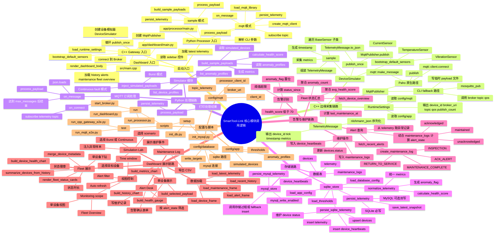

# SmartTool-Link Core Module Call Logic Mind Map

```mermaid
mindmap
  root((SmartTool-Link 核心模块调用逻辑))
    启动入口
      C++ Gateway 入口
        src/main.cpp
        load_runtime_settings
        创建 MqttPublisher
        connect 到 Broker
        创建设备模拟器 DeviceSimulator
        bootstrap_default_sensors
        循环 publish_once
      Python Processor 入口
        app/processor/main.py
        解析 CLI 参数
        sample 模式
          build_sample_payloads
          process_payload
          persist_telemetry
        mqtt 模式
          load_mqtt_library
          create_mqtt_client
          subscribe topic
          on_message
          process_payload
          persist_telemetry
      Dashboard 入口
        app/dashboard/main.py
        加载 latest telemetry
        加载 history alerts maintenance fleet overview
        读取 sidebar 控件
        render_dashboard_body
    C++ 边缘采集链路
      RuntimeSettings
        读取 config/app
        读取 config/mqtt
        输出 device_id broker_uri topic qos publish_count
      DeviceSimulator
        bootstrap_default_sensors
          TemperatureSensor
          VibrationSensor
          CurrentSensor
        sample
          遍历 BaseSensor 子类
          采集 metrics
          生成 timestamp
          组装 TelemetryMessage
        publish_once
          TelemetryMessage.to_json
          MqttPublisher.publish
      TelemetryMessage
        nlohmann_json 序列化
        输出 device_id tick timestamp metrics
      MqttPublisher
        Paho 原生路径
          mqtt::client.connect
          mqtt::make_message
          publish
        CLI fallback 路径
          mosquitto_pub
          写临时 payload 文件
          调用 broker topic qos
    Python 处理链路
      process_payload
        persist_telemetry
        打印处理结果
      Simulator 模块
        list_device_profiles
        list_anomaly_profiles
        build_sample_payloads
          读取 simulated_devices
          读取 anomaly_profiles
          生成 metrics
          calculate_health_score
        inject_simulated_payloads
          Burst 模式
          Continuous fault 模式
      MQTT 订阅处理
        on_connect
          subscribe telemetry topic
        on_message
          json.loads
          process_payload
          达到 max_messages 后结束
    存储链路
      sqlite_store
        load_app_config
        load_database_config
        load_thresholds
        normalize_telemetry
          统一 metrics
          calculate_health_score
          生成 anomaly_flag
        persist_sqlite_telemetry
          upsert devices
          insert telemetry
          insert device_heartbeats
          维护 device status
        persist_telemetry
          SQLite 必写
          MySQL 可选双写
          save_latest_snapshot
      mysql_store
        mysql_write_enabled
        persist_mysql_telemetry
        调用存储过程或 fallback insert
      数据表
        devices
        telemetry
        device_heartbeats
        maintenance_logs
    告警与维护链路
      告警识别
        阈值超限
        health_score 低于 70
        anomaly_flag 置位
      Alert 查询
        fetch_recent_alerts
        从 telemetry 取异常记录
        结合 maintenance_logs 计算 alert_state
          unacknowledged
          acknowledged
          maintained
      维护操作
        create_maintenance_log
          ACK_ALERT
          INSPECTION
          MAINTENANCE_COMPLETE
          RETURN_TO_SERVICE
        更新 devices.status
        写入 maintenance_logs
        写入 device_heartbeats
      Fleet 状态汇总
        fetch_device_overview
        聚合 avg_health_score
        聚合 anomaly_count
        计算 last_maintenance_at
        计算 status_since
    Dashboard 展示链路
      数据加载
        load_latest_telemetry
        load_recent_history
        load_alert_frame
        load_maintenance_frame
        load_device_frame
      视图控制
        Monitoring scope
          Fleet Overview
          单设备视图
        Time window
        Auto refresh
        Alert filter
      Fleet 展示
        summarize_devices_from_history
        merge_device_metadata
        render_fleet_status_cards
        build_device_health_chart
        状态徽章
        状态时长
        单设备下钻
      单设备展示
        build_selected_payload
        build_metrics_chart
        build_history_chart
        build_health_gauge
      Alert Desk
        按 alert_state 筛选
        告警确认表单
        写维护记录
      Maintenance Log
        展示维护事件
        导出 CSV
      Simulation Lab
        选择 scenario
        选择目标设备
        选择 Burst 或 Continuous
        注入异常样本
    配置与脚本
      config/app
        thresholds
        simulated_devices
        anomaly_profiles
      config/mqtt
        broker_uri
        topic_telemetry
        client_id
        processor_client_id
      config/database
        sqlite 路径
        mysql 连接
        write_targets
      scripts
        setup
          init_db.py
          init_mysql.py
        run
          run_processor.py
          run_dashboard.py
          start_broker.py
        test
          run_mqtt_e2e.py
          run_cpp_gateway_e2e.py
```
