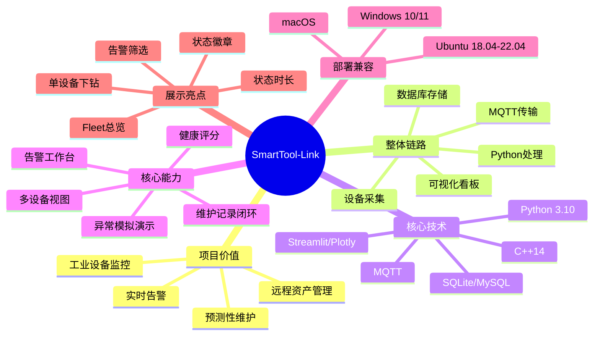

# SmartTool-Link 领导汇报版思维导图

适合做汇报首页、项目总览页、方案讲解第一页。

## 简版思维导图

## 30 秒讲解话术

- SmartTool-Link 是一套面向工业设备的端到端监控与分析网关。
- 它把设备采集、MQTT 传输、Python 分析、数据库存储和可视化看板打成一个闭环。
- 系统不仅能看数据，还能做告警确认、维护记录和异常模拟，适合演示真实运维流程。
- 当前方案支持 Windows、Ubuntu 和 macOS，具备从本地开发到后续扩展部署的基础能力。

## 汇报建议

- 如果是领导汇报，优先展示这张图。
- 如果是技术评审，再切换到 `docs/architecture/system-architecture-diagram.md`。
