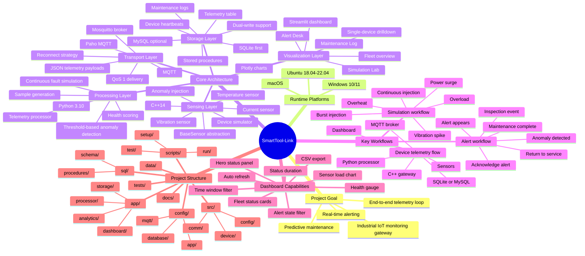
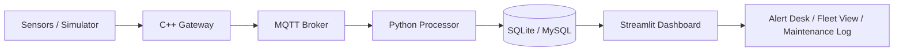

# SmartTool-Link Project Architecture Mind Map

This file is prepared for demos and presentations.
You can preview it in any Markdown tool that supports Mermaid.

## Mind Map

## End-to-End Flow

## Presentation Talking Points

- The project is a full industrial IoT loop from device simulation to dashboard operations.
- C++ focuses on edge collection and gateway publishing, while Python focuses on processing and visualization.
- MQTT decouples edge and backend, making the system extensible and resilient.
- SQLite gives a lightweight local development path, while MySQL supports future production scaling.
- The dashboard is not only visual; it also supports alerts, maintenance actions, filtering, exports, and simulation.
