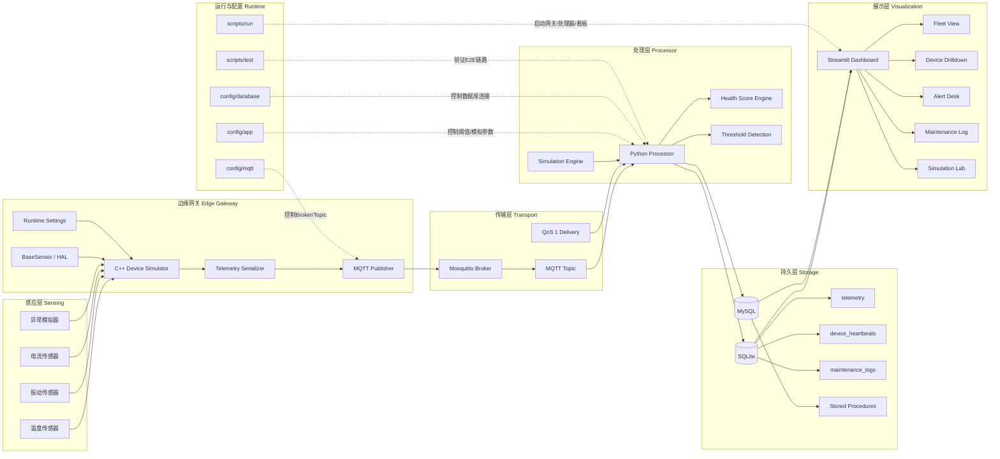
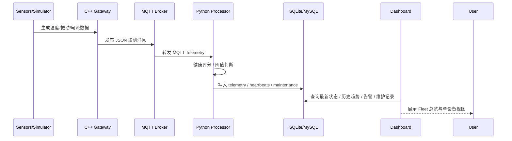

# SmartTool-Link 系统架构图

适合技术汇报、答辩、项目说明书、系统设计文档。

## 正式架构框图

## 数据流视角

## 展示建议

- 面向管理层：先用 `executive-mindmap.md`
- 面向技术评审：用本文件的“正式架构框图”
- 面向流程说明：用本文件的“数据流视角”

## 讲解顺序

- 先讲 5 层架构：采集、传输、处理、存储、展示
- 再讲端到端链路：C++ -> MQTT -> Python -> SQL -> Dashboard
- 最后讲项目亮点：多设备 Fleet、告警闭环、维护记录、异常模拟
